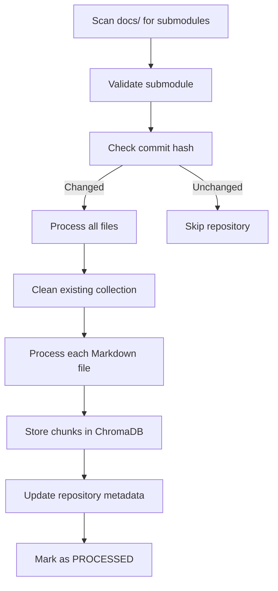

# Data Model: Hugo Documentation Retriever

**Date**: 2025-09-30  
**Feature**: Hugo Documentation Retriever  
**Branch**: 001-hetriever-stands-for

## Overview

This data model defines the entities, relationships, and state transitions for the Hugo Documentation Retriever system. All entities align with functional requirements and support the processing pipeline: fetch → clean → chunk → embed → store → retrieve.

## Core Entities

### 1. DocumentRepository

Represents a Git submodule containing Hugo documentation.

**Fields**:
- `name`: str - Unique identifier derived from submodule path (e.g., "istio-docs")
- `path`: Path - Absolute path to submodule directory
- `remote_url`: str - Git remote URL of documentation repository
- `branch`: str - Git branch/tag currently checked out
- `last_processed`: datetime - Timestamp of last successful processing
- `commit_hash`: str - Git commit SHA of last processed version
- `file_count`: int - Number of documentation files processed
- `chunk_count`: int - Number of chunks generated from this repository

**Validation Rules**:
- `path` must exist and be a valid Git repository
- `name` must be unique across all repositories
- `remote_url` must be a valid Git URL
- `commit_hash` must be a valid Git SHA (40 hex characters)

**State Transitions**:
```
NOT_PROCESSED → PROCESSING → PROCESSED
                     ↓
                  FAILED
```

**Relationships**:
- One repository has many DocumentFiles (1:N)
- One repository maps to one ChromaDB collection (1:1)

---

### 2. DocumentFile

Individual Markdown file from a documentation repository.

**Fields**:
- `file_path`: Path - Path relative to repository root (e.g., "docs/concepts/traffic.md")
- `repository_name`: str - Foreign key to DocumentRepository.name
- `content_raw`: str - Original file content including frontmatter
- `content_cleaned`: str - Processed content with Hugo syntax removed
- `frontmatter`: dict[str, Any] - Parsed frontmatter metadata (YAML/TOML)
- `last_modified`: datetime - File modification timestamp from filesystem
- `file_hash`: str - SHA256 hash of raw content for change detection
- `size_bytes`: int - File size in bytes
- `chunk_ids`: list[str] - List of chunk IDs generated from this file

**Validation Rules**:
- `file_path` must end with `.md` or `.markdown`
- `content_raw` must not be empty
- `file_hash` must be valid SHA256 hex string (64 characters)
- `frontmatter` must be valid YAML or TOML if present

**Frontmatter Schema** (Hugo-specific):
```python
{
    "title": str,                    # Document title
    "description": str | None,       # Short description
    "weight": int | None,            # Hugo ordering weight
    "aliases": list[str] | None,     # URL aliases
    "draft": bool,                   # Draft status
    "date": str | None,              # Publication date
    "tags": list[str] | None,        # Content tags
    "categories": list[str] | None,  # Content categories
}
```

**Relationships**:
- Many files belong to one DocumentRepository (N:1)
- One file generates many DocumentChunks (1:N)

---

### 3. DocumentChunk

Semantically segmented piece of cleaned documentation for embedding.

**Fields**:
- `chunk_id`: str - Unique identifier (UUID4)
- `file_path`: Path - Source file relative path
- `repository_name`: str - Source repository identifier
- `content`: str - Cleaned chunk text (target 800 tokens)
- `heading_context`: str - Parent heading hierarchy (e.g., "Installation > Prerequisites")
- `chunk_index`: int - Position within source file (0-based)
- `token_count`: int - Estimated token count for embedding model
- `metadata`: dict[str, Any] - Additional context for retrieval

**Validation Rules**:
- `content` must not be empty
- `token_count` should be between 100-2000 tokens
- `chunk_index` must be >= 0
- `chunk_id` must be unique across all chunks

**Metadata Schema**:
```python
{
    "title": str,              # From frontmatter
    "section": str,            # Parent heading
    "has_code": bool,          # Contains code blocks
    "tags": list[str],         # From frontmatter
    "processed_at": str,       # ISO timestamp
}
```

**Relationships**:
- Many chunks belong to one DocumentFile (N:1)
- One chunk generates one DocumentEmbedding (1:1)

---

### 4. DocumentEmbedding

Vector representation of a documentation chunk stored in ChromaDB.

**Fields**:
- `chunk_id`: str - Foreign key to DocumentChunk.chunk_id
- `embedding_vector`: list[float] - Dense vector (dimensionality: model-dependent, typically 384-1536)
- `embedding_model`: str - Model identifier (e.g., "all-MiniLM-L6-v2")
- `created_at`: datetime - Embedding generation timestamp

**Validation Rules**:
- `embedding_vector` length must match model dimensionality
- All vector values must be finite floats
- `embedding_model` must match configured ChromaDB embedding function

**Note**: This entity is managed by ChromaDB internally. Our application interacts via ChromaDB collection API rather than direct storage.

**Relationships**:
- One embedding maps to one DocumentChunk (1:1)
- All embeddings for a repository stored in one ChromaDB collection (N:1)

---

### 5. ChromaCollection

ChromaDB collection representing a documentation repository's embedded chunks.

**Fields**:
- `name`: str - Collection name (same as repository name)
- `metadata`: dict[str, Any] - Collection-level metadata
- `embedding_function`: str - Name of embedding function used
- `chunk_count`: int - Number of chunks in collection

**Metadata Schema**:
```python
{
    "repository_url": str,
    "last_updated": str,       # ISO timestamp
    "commit_hash": str,        # Git commit SHA
    "total_documents": int,    # Number of source files
    "total_chunks": int,       # Number of chunks
}
```

**ChromaDB Storage Structure**:
```python
{
    "ids": list[str],                    # chunk_ids
    "embeddings": list[list[float]],     # vectors
    "metadatas": list[dict[str, Any]],   # chunk metadata
    "documents": list[str],              # chunk content
}
```

**Relationships**:
- One collection maps to one DocumentRepository (1:1)
- One collection contains many DocumentEmbeddings (1:N)

---

### 6. RetrievalResult

Result of semantic search query against documentation.

**Fields**:
- `query`: str - Original search query
- `matches`: list[RetrievalMatch] - Ordered list of matching chunks
- `total_results`: int - Number of matches found
- `search_time_ms`: float - Query execution time

**RetrievalMatch Schema**:
```python
{
    "chunk_id": str,
    "content": str,
    "score": float,              # Similarity score (0.0-1.0)
    "repository": str,
    "file_path": str,
    "heading_context": str,
    "metadata": dict[str, Any],
}
```

**Validation Rules**:
- `matches` ordered by score descending
- `score` must be between 0.0 and 1.0
- `total_results` >= len(matches)

---

## Processing Pipeline State Machine

### File Processing States

```
DISCOVERED → PARSING → CLEANING → CHUNKING → EMBEDDING → STORED → INDEXED
               ↓           ↓          ↓           ↓          ↓
            FAILED      FAILED     FAILED      FAILED     FAILED
```

**State Descriptions**:
- **DISCOVERED**: File found in repository, pending processing
- **PARSING**: Extracting frontmatter and content
- **CLEANING**: Removing Hugo syntax, preserving structure
- **CHUNKING**: Splitting into semantic segments
- **EMBEDDING**: Generating vector representations
- **STORED**: Persisted to ChromaDB
- **INDEXED**: Available for retrieval queries
- **FAILED**: Processing error at any stage (with error message)

### Repository Processing Workflow



---

## Filesystem Structure

### ChromaDB Persistence

```
./chroma_data/
├── chroma.sqlite3              # ChromaDB metadata database
└── [collection-uuid]/          # Per-collection data
    ├── data_level0.bin         # Embeddings storage
    ├── header.bin
    ├── length.bin
    └── link_lists.bin
```

### Documentation Submodules

```
./docs/
├── istio-docs/                 # Git submodule
│   ├── .git
│   ├── content/
│   │   ├── en/
│   │   │   ├── docs/
│   │   │   │   ├── concepts/
│   │   │   │   ├── setup/
│   │   │   │   └── tasks/
│   └── ...
└── hugo-docs/                  # Git submodule
    └── ...
```

---

## Data Validation Rules Summary

### Input Validation
1. All file paths must be relative to repository root
2. Repository names must match `^[a-z0-9-]+$` pattern
3. Git commit hashes must be 40 hex characters
4. Frontmatter must be valid YAML or TOML or absent

### Processing Validation
1. Cleaned content must preserve at least 50% of original length (detect over-cleaning)
2. Chunks must be between 100-2000 tokens
3. Each file must generate at least 1 chunk
4. Embedding vectors must have consistent dimensionality per collection

### Storage Validation
1. ChromaDB collection names must match repository names
2. Chunk IDs must be unique within collection
3. All metadata fields must be JSON-serializable
4. File hashes must be unique within repository

---

## Performance Considerations

### Indexing Performance
- **Target**: Process 10,000 lines/second of documentation
- **Batch Size**: Process chunks in batches of 100 for ChromaDB insertion
- **Concurrency**: Process multiple files in parallel (asyncio)
- **Memory Budget**: <512MB total, stream large files

### Query Performance
- **Target**: <100ms for similarity search (p95)
- **Index Type**: ChromaDB default HNSW (Hierarchical Navigable Small World)
- **Result Limit**: Default 10 results, max 100
- **Caching**: ChromaDB handles internal caching

### Storage Estimates
- **Average Chunk**: ~800 tokens ≈ 3KB text
- **Embedding Size**: 384 dimensions × 4 bytes = 1.5KB per chunk
- **Metadata Overhead**: ~0.5KB per chunk
- **Total per Chunk**: ~5KB
- **100K chunks**: ~500MB disk space

---

## Error Handling

### Processing Errors

| Error Type | Handling Strategy | Recovery |
|------------|------------------|----------|
| Invalid Markdown | Log warning, skip file | Continue processing other files |
| Malformed Frontmatter | Extract as empty dict, log warning | Continue with content-only |
| Empty Cleaned Content | Skip file, log error | Don't create chunks |
| Embedding Failure | Retry 3x, then fail chunk | Continue other chunks |
| ChromaDB Connection | Fail entire operation | User must fix ChromaDB path |

### Data Integrity

**Transactional Behavior**:
- Repository processing is atomic per file
- If file processing fails, skip to next file
- If ChromaDB insertion fails, rollback collection update
- Track failed files in processing log for retry

**Idempotency**:
- Reprocessing same commit hash is no-op
- Updating submodule triggers full reprocessing of changed files
- Chunk IDs are deterministic (hash of repository + file + chunk index)

---

## Constitutional Alignment

**Code Quality (I)**: Data model defines clear entities with single responsibilities and minimal coupling.  
**User Experience (II)**: RetrievalResult provides both human-readable and machine-parseable output formats.  
**Performance (III)**: Processing pipeline designed for 10K lines/sec with <512MB memory footprint.  
**Python 3.13 (IV)**: Entity definitions use PEP 695 type syntax, pattern matching in parsers.  
**Minimal Dependencies (V)**: ChromaDB handles vector storage, embedding, and search without additional libraries.

---

## Next Steps

Phase 1 continues with:
1. **contracts/**: Define API contracts for CLI, ChromaDB operations, cleaning functions
2. **quickstart.md**: End-to-end test scenario validating data model
3. **AGENTS.md**: Agent context file with technology stack and conventions
